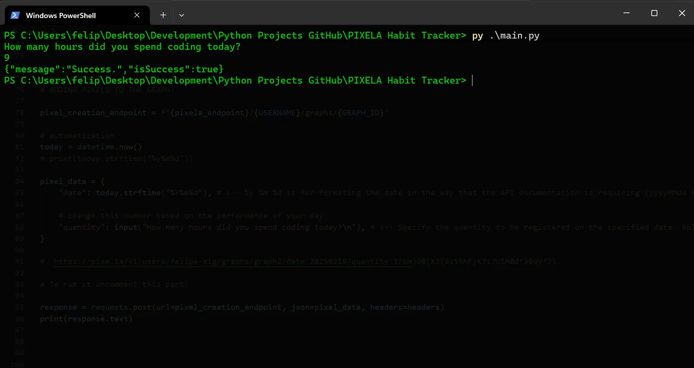
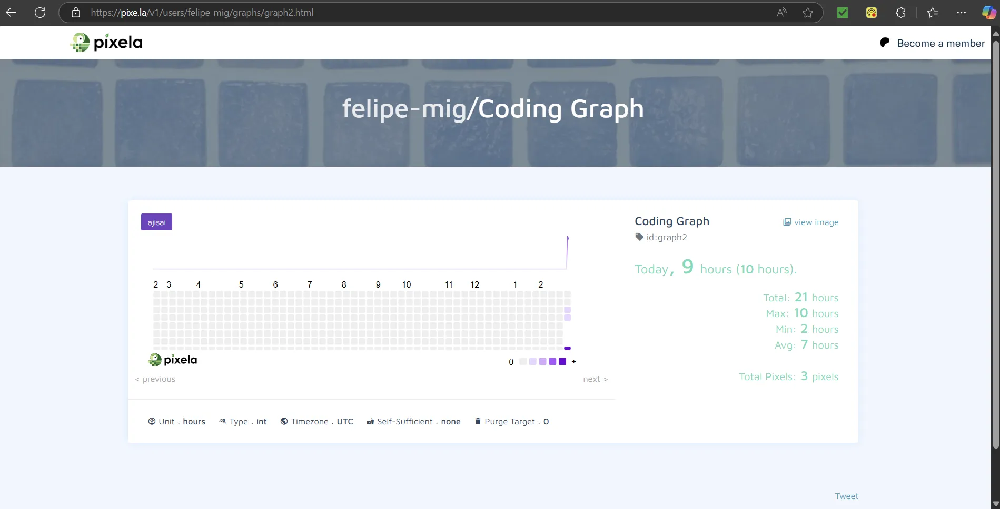

## 📄 Description

🔁This is a Python project in which I built a Habit Tracker program using the Japanese Pixela API.
The user can track their habits by running the program daily and adding the number of hours, kilometers, or any other unit they are tracking.
In this case, the program is set to track the number of hours spent coding each day.
Additionally, the user can update and delete records if necessary by uncommenting the indicated parts of the code.🔁

* No AI code🚫🤖 

## 📷 Screenshots

  

